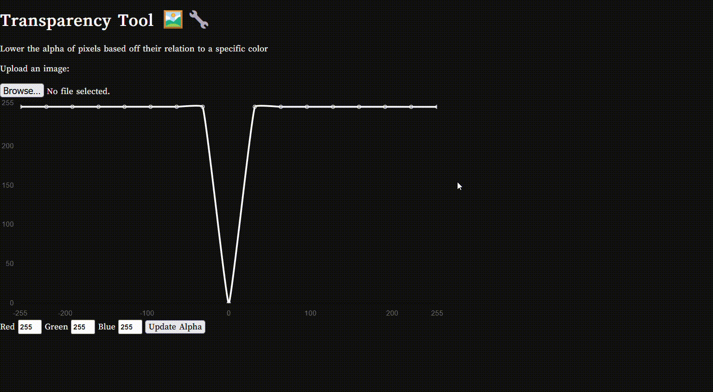

# Transparency Tool

## About
I created this tool to change the alpha of pixels in an image based off how close those pixels are to a particular color because I couldn't find an online tool that would do this exactly how I wanted.

## Website
Check out the website at [transparency-tool.vivime.info](https://transparency-tool.vivime.info)

## Demo
